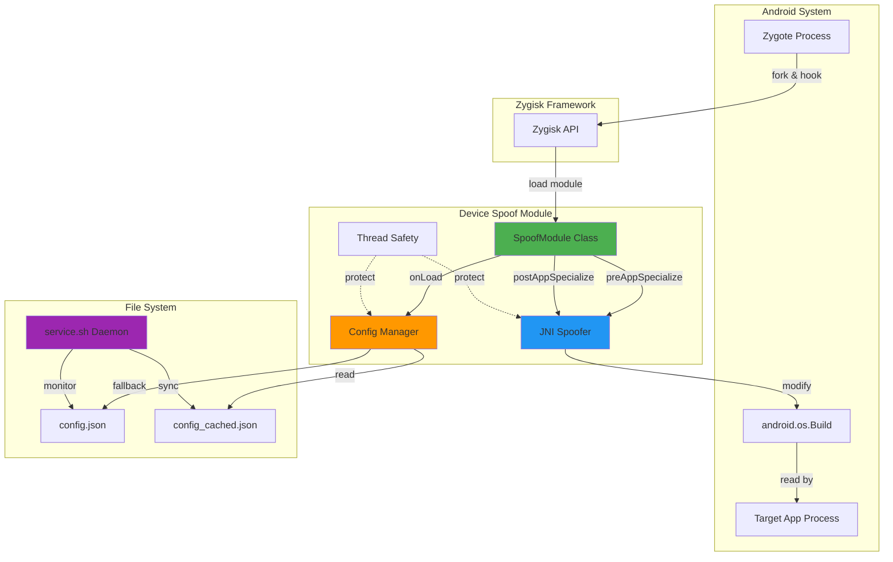
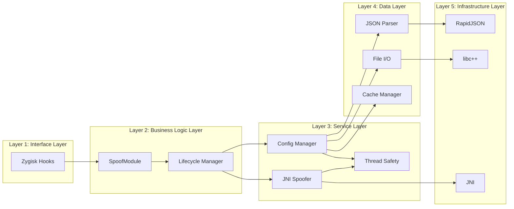
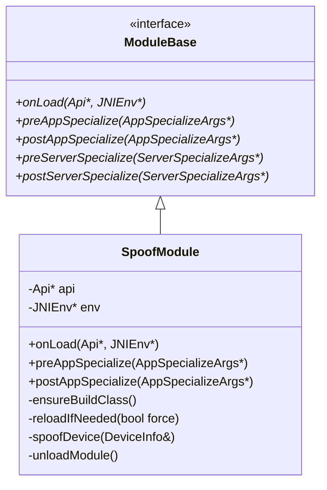
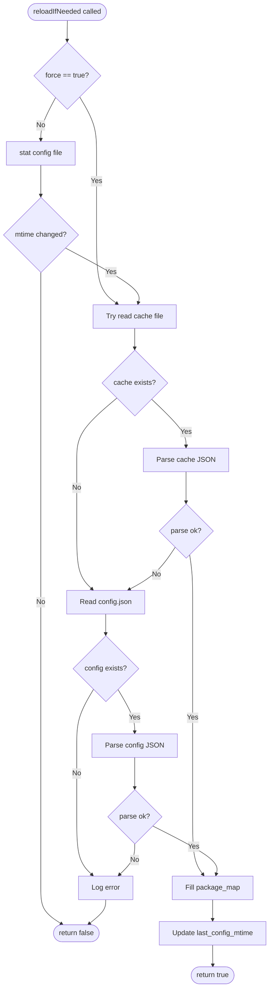
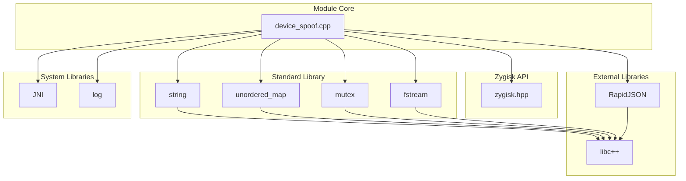
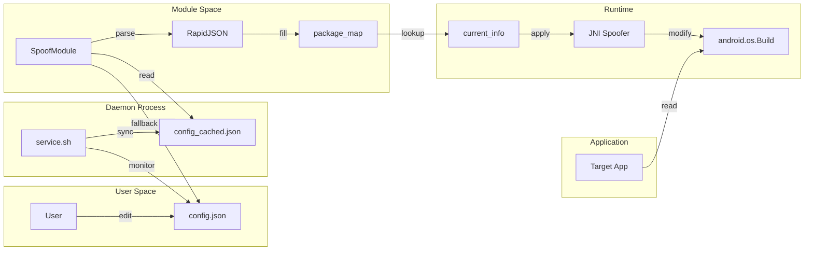
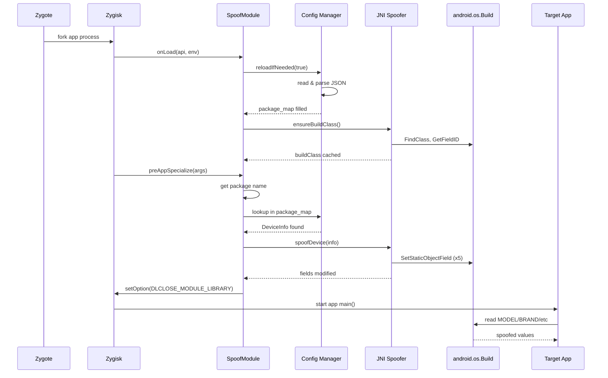
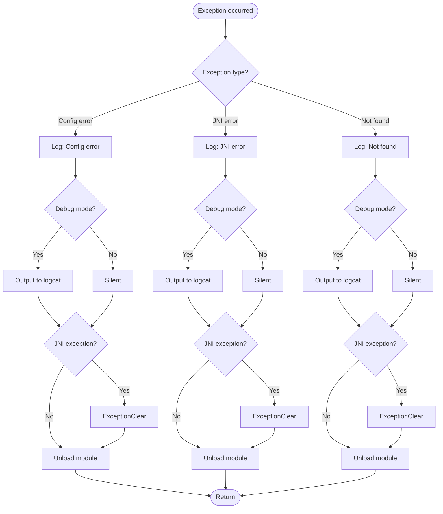

# DESIGN - Android 设备信息伪装模块架构设计

## 1. 整体架构图



## 2. 分层设计

### 2.1 架构分层



### 2.2 层次职责

| 层次 | 名称 | 职责 | 关键组件 |
|------|------|------|----------|
| L1 | 接口层 | 与 Zygisk 框架交互 | `onLoad`, `preAppSpecialize`, `postAppSpecialize` |
| L2 | 业务逻辑层 | 模块生命周期管理 | `SpoofModule` 类 |
| L3 | 服务层 | 核心功能实现 | 配置管理、JNI 伪装、线程安全 |
| L4 | 数据层 | 数据存储和解析 | JSON 解析、文件 I/O、缓存 |
| L5 | 基础设施层 | 底层库支持 | RapidJSON、libc++、JNI |

## 3. 核心组件设计

### 3.1 SpoofModule 类

#### 3.1.1 类图



#### 3.1.2 方法职责

| 方法 | 触发时机 | 职责 | 返回值 |
|------|----------|------|--------|
| `onLoad` | 模块加载时 | 初始化环境、加载配置、初始化 Build 类 | void |
| `preAppSpecialize` | 应用 fork 后、专属化前 | 获取包名、匹配配置、执行伪装 | void |
| `postAppSpecialize` | 应用专属化后 | 补充验证、再次伪装 | void |
| `ensureBuildClass` | onLoad 时 | 查找并缓存 Build 类和字段 ID | void |
| `reloadIfNeeded` | 需要配置时 | 检查并重新加载配置文件 | bool |
| `spoofDevice` | 匹配到包名时 | 修改 Build 类的静态字段 | void |
| `unloadModule` | 伪装完成后 | 卸载模块库（隐身模式） | void |

### 3.2 配置管理模块

#### 3.2.1 数据结构

```cpp
// 设备信息结构
struct DeviceInfo {
    std::string brand;
    std::string model;
    std::string device;
    std::string manufacturer;
    std::string product;
    
    DeviceInfo() = default;
    DeviceInfo(const std::string& b, const std::string& m, 
               const std::string& d, const std::string& mf, 
               const std::string& p)
        : brand(b), model(m), device(d), manufacturer(mf), product(p) {}
};

// 全局配置映射
std::unordered_map<std::string, DeviceInfo> package_map;

// 当前应用信息
DeviceInfo current_info;

// 配置文件路径
constexpr const char* CONFIG_CACHE_PATH = 
    "/data/adb/modules/zygisk_device_spoof/cache/config_cached.json";
constexpr const char* CONFIG_PATH = 
    "/data/adb/modules/zygisk_device_spoof/config/config.json";

// 配置文件修改时间
time_t last_config_mtime = 0;
```

#### 3.2.2 配置加载流程



#### 3.2.3 JSON 配置格式

```json
{
  "apps": [
    {
      "package": "com.example.targetapp",
      "brand": "Google",
      "model": "Pixel 7",
      "manufacturer": "Google",
      "device": "cheetah",
      "product": "cheetah"
    },
    {
      "package": "com.example.targetapp2",
      "brand": "Samsung",
      "model": "Galaxy S23",
      "manufacturer": "Samsung",
      "device": "dm3q",
      "product": "dm3qxxx"
    }
  ]
}
```

### 3.3 JNI 伪装模块

#### 3.3.1 JNI 缓存结构

```cpp
// Build 类全局引用
jclass buildClass = nullptr;

// 字段 ID 缓存
jfieldID modelField = nullptr;
jfieldID brandField = nullptr;
jfieldID deviceField = nullptr;
jfieldID manufacturerField = nullptr;
jfieldID productField = nullptr;

// 初始化标志
std::once_flag build_class_init_flag;
```

#### 3.3.2 Build 类初始化流程

```mermaid
sequenceDiagram
    participant Module as SpoofModule
    participant Once as std::call_once
    participant JNI as JNI Environment
    participant Build as android.os.Build
    
    Module->>Once: ensureBuildClass()
    Once->>JNI: FindClass("android/os/Build")
    JNI-->>Once: jclass localRef
    Once->>JNI: NewGlobalRef(localRef)
    JNI-->>Once: buildClass (global)
    Once->>JNI: DeleteLocalRef(localRef)
    
    Once->>JNI: GetStaticFieldID(buildClass, "MODEL", "Ljava/lang/String;")
    JNI-->>Once: modelField
    Once->>JNI: GetStaticFieldID(buildClass, "BRAND", "Ljava/lang/String;")
    JNI-->>Once: brandField
    Once->>JNI: GetStaticFieldID(buildClass, "DEVICE", "Ljava/lang/String;")
    JNI-->>Once: deviceField
    Once->>JNI: GetStaticFieldID(buildClass, "MANUFACTURER", "Ljava/lang/String;")
    JNI-->>Once: manufacturerField
    Once->>JNI: GetStaticFieldID(buildClass, "PRODUCT", "Ljava/lang/String;")
    JNI-->>Once: productField
    
    Once-->>Module: Initialization complete
```

#### 3.3.3 字段修改流程

```mermaid
flowchart TD
    Start([spoofDevice called]) --> CheckClass{buildClass valid?}
    CheckClass -->|No| LogError[Log error] --> Return([return])
    CheckClass -->|Yes| CreateModel[NewStringUTF model]
    
    CreateModel --> SetModel[SetStaticObjectField MODEL]
    SetModel --> CheckEx1{ExceptionCheck?}
    CheckEx1 -->|Yes| ClearEx1[ExceptionClear] --> DeleteModel
    CheckEx1 -->|No| DeleteModel[DeleteLocalRef]
    
    DeleteModel --> CreateBrand[NewStringUTF brand]
    CreateBrand --> SetBrand[SetStaticObjectField BRAND]
    SetBrand --> CheckEx2{ExceptionCheck?}
    CheckEx2 -->|Yes| ClearEx2[ExceptionClear] --> DeleteBrand
    CheckEx2 -->|No| DeleteBrand[DeleteLocalRef]
    
    DeleteBrand --> CreateDevice[NewStringUTF device]
    CreateDevice --> SetDevice[SetStaticObjectField DEVICE]
    SetDevice --> CheckEx3{ExceptionCheck?}
    CheckEx3 -->|Yes| ClearEx3[ExceptionClear] --> DeleteDevice
    CheckEx3 -->|No| DeleteDevice[DeleteLocalRef]
    
    DeleteDevice --> CreateMfr[NewStringUTF manufacturer]
    CreateMfr --> SetMfr[SetStaticObjectField MANUFACTURER]
    SetMfr --> CheckEx4{ExceptionCheck?}
    CheckEx4 -->|Yes| ClearEx4[ExceptionClear] --> DeleteMfr
    CheckEx4 -->|No| DeleteMfr[DeleteLocalRef]
    
    DeleteMfr --> CreateProduct[NewStringUTF product]
    CreateProduct --> SetProduct[SetStaticObjectField PRODUCT]
    SetProduct --> CheckEx5{ExceptionCheck?}
    CheckEx5 -->|Yes| ClearEx5[ExceptionClear] --> DeleteProduct
    CheckEx5 -->|No| DeleteProduct[DeleteLocalRef]
    
    DeleteProduct --> LogSuccess[Log success] --> Return
```



### 3.4 线程安全模块

#### 3.4.1 线程安全机制

```cpp
// 配置加载互斥锁
std::mutex config_mutex;

// Build 类初始化标志（确保单次执行）
std::once_flag build_class_init_flag;

// 使用示例
void reloadIfNeeded(bool force) {
    std::lock_guard<std::mutex> lock(config_mutex);
    // ... 配置加载逻辑
}

void ensureBuildClass() {
    std::call_once(build_class_init_flag, []() {
        // ... Build 类初始化逻辑
    });
}
```

#### 3.4.2 并发场景分析

| 场景 | 并发风险 | 保护机制 | 说明 |
|------|----------|----------|------|
| 配置加载 | 多线程同时读取配置 | `std::mutex` | 虽然 Zygisk 钩子通常单线程，但防御性编程 |
| Build 类初始化 | 多次初始化导致内存泄漏 | `std::once_flag` | 确保全局引用只创建一次 |
| 字段修改 | 同时修改不同字段 | 无需保护 | JNI 操作原子性由 JVM 保证 |
| 配置映射访问 | 读写冲突 | `std::mutex` | 保护 `package_map` 的读写 |

## 4. 模块依赖关系图



## 5. 接口契约定义

### 5.1 Zygisk 接口契约

#### onLoad
```cpp
/**
 * @brief 模块加载时调用
 * @param api Zygisk API 指针，用于后续操作
 * @param env JNI 环境指针，用于 JNI 操作
 * @pre api != nullptr && env != nullptr
 * @post buildClass != nullptr (如果成功)
 * @post package_map 已填充配置数据
 */
void onLoad(Api *api, JNIEnv *env) override;
```

#### preAppSpecialize
```cpp
/**
 * @brief 应用进程专属化前调用（主要伪装时机）
 * @param args 应用专属化参数，包含包名等信息
 * @pre args != nullptr && args->nice_name != nullptr
 * @post 如果包名匹配，Build 字段已修改
 * @post 模块已卸载（隐身模式）
 */
void preAppSpecialize(AppSpecializeArgs *args) override;
```

#### postAppSpecialize
```cpp
/**
 * @brief 应用进程专属化后调用（补充验证）
 * @param args 应用专属化参数
 * @pre args != nullptr
 * @post 如果需要，Build 字段已再次修改
 * @post 模块已卸载（隐身模式）
 */
void postAppSpecialize(const AppSpecializeArgs *args) override;
```

### 5.2 内部接口契约

#### ensureBuildClass
```cpp
/**
 * @brief 确保 Build 类已加载并缓存
 * @pre env != nullptr
 * @post buildClass != nullptr (如果成功)
 * @post 所有字段 ID 已获取
 * @throws 无异常（内部捕获并清除 JNI 异常）
 * @note 使用 std::call_once 确保只执行一次
 */
void ensureBuildClass();
```

#### reloadIfNeeded
```cpp
/**
 * @brief 检查并重新加载配置文件
 * @param force 是否强制重新加载（忽略 mtime 检查）
 * @return true 如果配置已加载/更新，false 如果无需更新或失败
 * @pre 配置文件路径有效
 * @post package_map 已更新（如果成功）
 * @post last_config_mtime 已更新
 * @note 线程安全（使用 std::mutex）
 */
bool reloadIfNeeded(bool force = false);
```

#### spoofDevice
```cpp
/**
 * @brief 修改 Build 类的静态字段
 * @param info 设备信息结构，包含要伪装的值
 * @pre buildClass != nullptr
 * @pre 所有字段 ID 有效
 * @post Build.MODEL/BRAND/DEVICE/MANUFACTURER/PRODUCT 已修改
 * @throws 无异常（内部捕获并清除 JNI 异常）
 */
void spoofDevice(const DeviceInfo& info);
```

### 5.3 配置文件契约

#### JSON Schema
```json
{
  "$schema": "http://json-schema.org/draft-07/schema#",
  "type": "object",
  "required": ["apps"],
  "properties": {
    "apps": {
      "type": "array",
      "items": {
        "type": "object",
        "required": ["package", "brand", "model", "device", "manufacturer", "product"],
        "properties": {
          "package": {
            "type": "string",
            "description": "应用包名（精确匹配）",
            "pattern": "^[a-zA-Z][a-zA-Z0-9_]*(\\.[a-zA-Z][a-zA-Z0-9_]*)+$"
          },
          "brand": {
            "type": "string",
            "description": "设备品牌（Build.BRAND）"
          },
          "model": {
            "type": "string",
            "description": "设备型号（Build.MODEL）"
          },
          "device": {
            "type": "string",
            "description": "设备代号（Build.DEVICE）"
          },
          "manufacturer": {
            "type": "string",
            "description": "制造商（Build.MANUFACTURER）"
          },
          "product": {
            "type": "string",
            "description": "产品名称（Build.PRODUCT）"
          }
        }
      }
    }
  }
}
```

## 6. 数据流向图

### 6.1 配置数据流



### 6.2 应用启动数据流



## 7. 异常处理策略

### 7.1 异常分类

| 异常类型 | 严重程度 | 处理策略 | 示例 |
|----------|----------|----------|------|
| 配置文件不存在 | 中 | 记录日志，卸载模块 | config.json 未创建 |
| 配置文件格式错误 | 中 | 记录日志，卸载模块 | JSON 语法错误 |
| Build 类查找失败 | 高 | 记录日志，卸载模块 | ROM 修改了类名 |
| 字段 ID 获取失败 | 高 | 记录日志，卸载模块 | 字段不存在 |
| 字段修改失败 | 中 | 清除异常，继续执行 | JNI 异常 |
| 包名不匹配 | 低 | 静默卸载模块 | 非目标应用 |
| 内存分配失败 | 高 | 记录日志，卸载模块 | OOM |

### 7.2 异常处理流程



### 7.3 JNI 异常处理模式

```cpp
// 异常处理辅助函数
inline bool checkAndClearException(JNIEnv* env, const char* operation) {
    if (env->ExceptionCheck()) {
        #ifdef DEBUG
        LOGD("JNI exception during %s", operation);
        env->ExceptionDescribe(); // 输出异常详情
        #endif
        env->ExceptionClear();
        return true;
    }
    return false;
}

// 使用示例
void spoofDevice(const DeviceInfo& info) {
    jstring jModel = env->NewStringUTF(info.model.c_str());
    if (!jModel) {
        checkAndClearException(env, "NewStringUTF(model)");
        return;
    }
    
    env->SetStaticObjectField(buildClass, modelField, jModel);
    if (checkAndClearException(env, "SetStaticObjectField(MODEL)")) {
        env->DeleteLocalRef(jModel);
        return;
    }
    
    env->DeleteLocalRef(jModel);
    // ... 继续处理其他字段
}
```

## 8. 性能优化设计

### 8.1 优化策略

| 优化点 | 策略 | 预期效果 |
|--------|------|----------|
| Build 类查找 | 全局引用缓存 + `std::once_flag` | 避免重复查找，减少 99% 查找开销 |
| 字段 ID 获取 | 静态变量缓存 | 避免重复获取，减少 JNI 调用 |
| 配置文件读取 | 优先读取缓存文件 | 减少 I/O 操作，提升 50% 加载速度 |
| 配置文件解析 | mtime 检查 + 增量加载 | 避免不必要的解析，减少 90% 解析开销 |
| 字符串创建 | 局部引用 + 及时释放 | 避免内存泄漏，减少 GC 压力 |
| 日志输出 | 编译时条件编译 | Release 版本零日志开销 |

### 8.2 内存管理

```cpp
// RAII 包装器：自动管理 JNI 字符串
class JniString {
public:
    JniString(JNIEnv* env, jstring jstr) 
        : env_(env), jstr_(jstr), 
          cstr_(env->GetStringUTFChars(jstr, nullptr)) {}
    
    ~JniString() {
        if (cstr_) {
            env_->ReleaseStringUTFChars(jstr_, cstr_);
        }
    }
    
    const char* c_str() const { return cstr_; }
    
    // 禁止拷贝
    JniString(const JniString&) = delete;
    JniString& operator=(const JniString&) = delete;
    
private:
    JNIEnv* env_;
    jstring jstr_;
    const char* cstr_;
};

// 使用示例
void preAppSpecialize(AppSpecializeArgs *args) {
    JniString packageName(env, args->nice_name);
    std::string package = packageName.c_str();
    // ... 自动释放
}
```

### 8.3 时间复杂度分析

| 操作 | 时间复杂度 | 说明 |
|------|-----------|------|
| 配置加载 | O(n) | n = 配置中的应用数量 |
| 包名查找 | O(1) | 使用 `std::unordered_map` |
| Build 类初始化 | O(1) | 只执行一次 |
| 字段修改 | O(1) | 固定 5 个字段 |
| 配置文件监控 | O(1) | inotifywait 事件驱动 |

## 9. 安全性设计

### 9.1 隐身模式

```cpp
// 伪装完成后立即卸载模块
void unloadModule() {
    if (api) {
        api->setOption(zygisk::Option::DLCLOSE_MODULE_LIBRARY);
        #ifdef DEBUG
        LOGD("Module unloaded (stealth mode)");
        #endif
    }
}
```

### 9.2 文件权限控制

| 文件/目录 | 权限 | 所有者 | 说明 |
|-----------|------|--------|------|
| `/data/adb/modules/zygisk_device_spoof/` | 0755 | root:root | 模块根目录 |
| `/data/adb/modules/zygisk_device_spoof/config/` | 0755 | root:root | 配置目录 |
| `/data/adb/modules/zygisk_device_spoof/config/config.json` | 0644 | root:root | 配置文件（root 可写） |
| `/data/adb/modules/zygisk_device_spoof/cache/` | 0755 | root:root | 缓存目录 |
| `/data/adb/modules/zygisk_device_spoof/cache/config_cached.json` | 0644 | root:root | 缓存文件 |

### 9.3 SELinux 兼容性

- 使用标准 `/data/adb/modules/` 路径，通常具有正确的 SELinux 上下文
- 文件操作使用标准 C++ 文件 I/O，避免直接系统调用
- 守护进程使用 shell 脚本，继承系统 SELinux 上下文

## 10. 调试支持设计

### 10.1 日志级别

```cpp
#ifdef DEBUG
#define LOGD(...) __android_log_print(ANDROID_LOG_DEBUG, "ZygiskDeviceSpoof", __VA_ARGS__)
#define LOGI(...) __android_log_print(ANDROID_LOG_INFO, "ZygiskDeviceSpoof", __VA_ARGS__)
#define LOGW(...) __android_log_print(ANDROID_LOG_WARN, "ZygiskDeviceSpoof", __VA_ARGS__)
#define LOGE(...) __android_log_print(ANDROID_LOG_ERROR, "ZygiskDeviceSpoof", __VA_ARGS__)
#else
#define LOGD(...)
#define LOGI(...)
#define LOGW(...)
#define LOGE(...)
#endif
```

### 10.2 关键日志点

| 阶段 | 日志内容 | 级别 |
|------|----------|------|
| 模块加载 | "Module loaded, version: X.X.X" | INFO |
| 配置加载 | "Config loaded: N apps" | DEBUG |
| 包名匹配 | "Package matched: com.example.app" | DEBUG |
| 伪装执行 | "Spoofed to: Brand Model" | DEBUG |
| 异常处理 | "Failed to find Build class" | ERROR |
| 模块卸载 | "Module unloaded" | DEBUG |

## 11. 设计验证

### 11.1 架构一致性检查
- ✅ 与现有 Zygisk 模块结构一致
- ✅ 复用现有构建系统
- ✅ 复用现有 libc++
- ✅ 遵循 C++20 标准

### 11.2 接口完整性检查
- ✅ 所有 Zygisk 钩子已实现
- ✅ 所有内部接口已定义
- ✅ 所有数据结构已设计

### 11.3 性能目标验证
- ✅ 配置加载 < 100ms（O(n) 复杂度，n 通常 < 100）
- ✅ 伪装操作 < 10ms（O(1) 复杂度，5 次 JNI 调用）
- ✅ 应用启动延迟 < 50ms（缓存优化）

### 11.4 安全性验证
- ✅ 隐身模式已设计
- ✅ 文件权限已定义
- ✅ SELinux 兼容性已考虑

## 12. 下一步

进入 **阶段3: Atomize (原子化阶段)**，创建详细的任务拆分文档 `TASK_device_spoof.md`。


