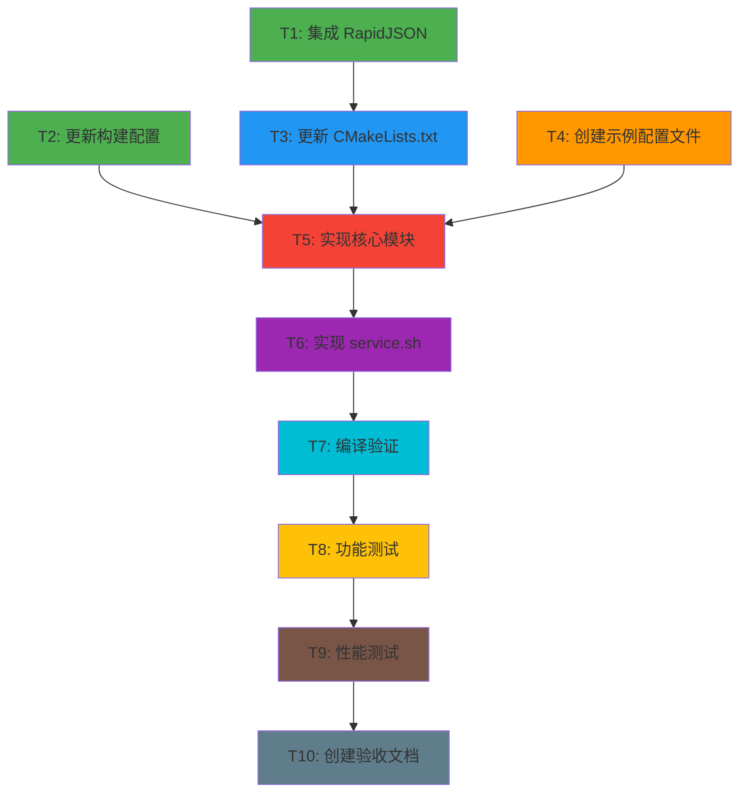

# TASK - Android 设备信息伪装模块任务拆分

## 任务依赖图



## 任务列表

### T1: 集成 RapidJSON 库

**优先级**: P0（阻塞任务）  
**预计时间**: 10 分钟  
**复杂度**: 低

#### 输入契约
- **前置依赖**: 无
- **输入数据**: RapidJSON v1.1.0 源码
- **环境依赖**: 网络连接（下载）

#### 输出契约
- **输出数据**: RapidJSON header 文件
- **交付物**: 
  - `module/src/main/cpp/external/rapidjson/include/rapidjson/` 目录
  - 包含 `document.h`, `rapidjson.h`, `reader.h`, `writer.h` 等核心头文件
- **验收标准**:
  - [ ] RapidJSON 头文件已下载到正确路径
  - [ ] 目录结构完整
  - [ ] 文件数量 > 50 个头文件

#### 实现约束
- **技术栈**: 文件系统操作
- **接口规范**: Header-only 模式，无需编译
- **质量要求**: 使用官方发布版本，确保完整性

#### 实现步骤
1. 创建目录 `module/src/main/cpp/external/rapidjson/`
2. 下载 RapidJSON v1.1.0 源码（或从 GitHub 克隆）
3. 复制 `include/rapidjson/` 目录到项目
4. 验证文件完整性

#### 依赖关系
- **后置任务**: T3 (更新 CMakeLists.txt)
- **并行任务**: T2 (更新构建配置), T4 (创建示例配置文件)

---

### T2: 更新项目构建配置

**优先级**: P0（阻塞任务）  
**预计时间**: 15 分钟  
**复杂度**: 低

#### 输入契约
- **前置依赖**: 无
- **输入数据**: 
  - 模块 ID: `zygisk_device_spoof`
  - 模块名称: `Zygisk Device Spoof`
  - 命名空间: `io.github.qjj0204.zygisk.device.spoof`
  - 作者: `Qjj0204`
- **环境依赖**: Gradle 构建环境

#### 输出契约
- **输出数据**: 更新后的构建配置文件
- **交付物**:
  - `build.gradle.kts` (根目录)
  - `module/template/module.prop`
- **验收标准**:
  - [ ] 模块 ID 已更新为 `zygisk_device_spoof`
  - [ ] 模块名称已更新为 `Zygisk Device Spoof`
  - [ ] 命名空间已更新
  - [ ] 作者信息已更新
  - [ ] SO 库名称为 `zygisk_device_spoof.so`

#### 实现约束
- **技术栈**: Gradle/Kotlin DSL
- **接口规范**: 遵循现有构建脚本格式
- **质量要求**: 语法正确，可编译

#### 实现步骤
1. 修改 `build.gradle.kts`:
   - `moduleId`: `"sample"` → `"zygisk_device_spoof"`
   - `moduleName`: `"Zygisk Module Sample"` → `"Zygisk Device Spoof"`
   - `namespace`: 添加 `io.github.qjj0204.zygisk.device.spoof`
2. 修改 `module/template/module.prop`:
   - `id`: `zygisk_device_spoof`
   - `name`: `Zygisk Device Spoof`
   - `author`: `Qjj0204`
   - `description`: `A module used to spoof device info.`

#### 依赖关系
- **后置任务**: T5 (实现核心模块)
- **并行任务**: T1 (集成 RapidJSON), T4 (创建示例配置文件)

---

### T3: 更新 CMakeLists.txt 配置

**优先级**: P0（阻塞任务）  
**预计时间**: 10 分钟  
**复杂度**: 低

#### 输入契约
- **前置依赖**: T1 (RapidJSON 已集成)
- **输入数据**: RapidJSON include 路径
- **环境依赖**: CMake 3.22.1+

#### 输出契约
- **输出数据**: 更新后的 CMakeLists.txt
- **交付物**: `module/src/main/cpp/CMakeLists.txt`
- **验收标准**:
  - [ ] 源文件改为 `device_spoof.cpp`
  - [ ] 添加 RapidJSON include 路径
  - [ ] 模块名称使用 `${MODULE_NAME}` (由 Gradle 传递)
  - [ ] 移除 Companion 相关配置

#### 实现约束
- **技术栈**: CMake
- **接口规范**: 遵循现有 CMake 配置格式
- **质量要求**: 语法正确，可编译

#### 实现步骤
1. 修改 `add_library` 源文件: `example.cpp` → `device_spoof.cpp`
2. 添加 RapidJSON include 路径:
   ```cmake
   target_include_directories(${MODULE_NAME} PRIVATE 
       external/rapidjson/include
   )
   ```
3. 确保链接 `cxx` 和 `log` 库
4. 移除任何 Companion 相关配置（如果有）

#### 依赖关系
- **前置任务**: T1 (集成 RapidJSON)
- **后置任务**: T5 (实现核心模块)
- **并行任务**: T2 (更新构建配置), T4 (创建示例配置文件)

---

### T4: 创建示例配置文件

**优先级**: P1（重要任务）  
**预计时间**: 10 分钟  
**复杂度**: 低

#### 输入契约
- **前置依赖**: 无
- **输入数据**: JSON 配置格式规范
- **环境依赖**: 文本编辑器

#### 输出契约
- **输出数据**: 示例配置文件
- **交付物**: `module/template/config/config.json`
- **验收标准**:
  - [ ] JSON 格式正确（可解析）
  - [ ] 包含至少 2 个示例应用配置
  - [ ] 包含注释说明（JSON 不支持注释，使用 README）
  - [ ] 所有必需字段完整

#### 实现约束
- **技术栈**: JSON
- **接口规范**: 遵循 DESIGN 文档中的 JSON Schema
- **质量要求**: 格式规范，易于理解

#### 实现步骤
1. 创建目录 `module/template/config/`
2. 创建 `config.json` 文件
3. 添加示例配置（Google Pixel 7, Samsung Galaxy S23）
4. 创建 `README.md` 说明配置格式

#### 示例内容
```json
{
  "apps": [
    {
      "package": "com.example.targetapp",
      "brand": "Google",
      "model": "Pixel 7",
      "manufacturer": "Google",
      "device": "cheetah",
      "product": "cheetah"
    },
    {
      "package": "com.example.targetapp2",
      "brand": "Samsung",
      "model": "Galaxy S23",
      "manufacturer": "Samsung",
      "device": "dm3q",
      "product": "dm3qxxx"
    }
  ]
}
```

#### 依赖关系
- **后置任务**: T5 (实现核心模块)
- **并行任务**: T1, T2, T3

---

### T5: 实现核心模块 device_spoof.cpp

**优先级**: P0（核心任务）  
**预计时间**: 90 分钟  
**复杂度**: 高

#### 输入契约
- **前置依赖**: 
  - T1 (RapidJSON 已集成)
  - T2 (构建配置已更新)
  - T3 (CMakeLists.txt 已更新)
  - T4 (示例配置文件已创建)
- **输入数据**: 
  - Zygisk API (`zygisk.hpp`)
  - RapidJSON API
  - JNI API
- **环境依赖**: C++20 编译器，NDK

#### 输出契约
- **输出数据**: 完整的模块实现
- **交付物**: `module/src/main/cpp/device_spoof.cpp`
- **验收标准**:
  - [ ] 实现所有 Zygisk 钩子（onLoad, preAppSpecialize, postAppSpecialize）
  - [ ] 实现配置管理（加载、解析、缓存）
  - [ ] 实现 JNI 伪装（查找类、修改字段）
  - [ ] 实现线程安全（mutex, once_flag）
  - [ ] 实现异常处理（JNI 异常清除）
  - [ ] 实现隐身模式（DLCLOSE_MODULE_LIBRARY）
  - [ ] 实现调试日志（条件编译）
  - [ ] 代码编译通过，无警告

#### 实现约束
- **技术栈**: C++20, JNI, RapidJSON, Zygisk API
- **接口规范**: 遵循 DESIGN 文档中的接口契约
- **质量要求**: 
  - 代码规范（遵循现有代码风格）
  - 注释清晰
  - 异常处理完善
  - 内存管理正确（无泄漏）

#### 实现步骤

##### 5.1 文件结构和头文件
```cpp
#include <cstdlib>
#include <unistd.h>
#include <fcntl.h>
#include <sys/stat.h>
#include <android/log.h>
#include <string>
#include <unordered_map>
#include <fstream>
#include <mutex>
#include "zygisk.hpp"
#include "rapidjson/document.h"
#include "rapidjson/istreamwrapper.h"

// 日志宏定义
#ifdef DEBUG
#define LOGD(...) __android_log_print(ANDROID_LOG_DEBUG, "ZygiskDeviceSpoof", __VA_ARGS__)
#define LOGI(...) __android_log_print(ANDROID_LOG_INFO, "ZygiskDeviceSpoof", __VA_ARGS__)
#define LOGW(...) __android_log_print(ANDROID_LOG_WARN, "ZygiskDeviceSpoof", __VA_ARGS__)
#define LOGE(...) __android_log_print(ANDROID_LOG_ERROR, "ZygiskDeviceSpoof", __VA_ARGS__)
#else
#define LOGD(...)
#define LOGI(...)
#define LOGW(...)
#define LOGE(...)
#endif
```

##### 5.2 数据结构定义
```cpp
// 设备信息结构
struct DeviceInfo {
    std::string brand;
    std::string model;
    std::string device;
    std::string manufacturer;
    std::string product;
};

// 全局变量
static std::unordered_map<std::string, DeviceInfo> package_map;
static DeviceInfo current_info;
static std::mutex config_mutex;
static std::once_flag build_class_init_flag;

// JNI 缓存
static jclass buildClass = nullptr;
static jfieldID modelField = nullptr;
static jfieldID brandField = nullptr;
static jfieldID deviceField = nullptr;
static jfieldID manufacturerField = nullptr;
static jfieldID productField = nullptr;

// 配置文件路径
constexpr const char* CONFIG_CACHE_PATH = 
    "/data/adb/modules/zygisk_device_spoof/cache/config_cached.json";
constexpr const char* CONFIG_PATH = 
    "/data/adb/modules/zygisk_device_spoof/config/config.json";

static time_t last_config_mtime = 0;
```

##### 5.3 辅助类：JniString (RAII)
```cpp
class JniString {
public:
    JniString(JNIEnv* env, jstring jstr) 
        : env_(env), jstr_(jstr), 
          cstr_(jstr ? env->GetStringUTFChars(jstr, nullptr) : nullptr) {}
    
    ~JniString() {
        if (cstr_) {
            env_->ReleaseStringUTFChars(jstr_, cstr_);
        }
    }
    
    const char* c_str() const { return cstr_; }
    operator bool() const { return cstr_ != nullptr; }
    
    JniString(const JniString&) = delete;
    JniString& operator=(const JniString&) = delete;
    
private:
    JNIEnv* env_;
    jstring jstr_;
    const char* cstr_;
};
```

##### 5.4 异常处理辅助函数
```cpp
inline bool checkAndClearException(JNIEnv* env, const char* operation) {
    if (env->ExceptionCheck()) {
        LOGE("JNI exception during %s", operation);
        #ifdef DEBUG
        env->ExceptionDescribe();
        #endif
        env->ExceptionClear();
        return true;
    }
    return false;
}
```

##### 5.5 SpoofModule 类定义
```cpp
class SpoofModule : public zygisk::ModuleBase {
public:
    void onLoad(zygisk::Api *api, JNIEnv *env) override;
    void preAppSpecialize(zygisk::AppSpecializeArgs *args) override;
    void postAppSpecialize(const zygisk::AppSpecializeArgs *args) override;

private:
    zygisk::Api *api = nullptr;
    JNIEnv *env = nullptr;
    
    void ensureBuildClass();
    bool reloadIfNeeded(bool force = false);
    void spoofDevice(const DeviceInfo& info);
    void unloadModule();
};
```

##### 5.6 实现 ensureBuildClass()
```cpp
void SpoofModule::ensureBuildClass() {
    std::call_once(build_class_init_flag, [this]() {
        jclass localClass = env->FindClass("android/os/Build");
        if (!localClass || checkAndClearException(env, "FindClass(Build)")) {
            LOGE("Failed to find Build class");
            return;
        }
        
        buildClass = (jclass)env->NewGlobalRef(localClass);
        env->DeleteLocalRef(localClass);
        
        if (!buildClass) {
            LOGE("Failed to create global ref for Build class");
            return;
        }
        
        modelField = env->GetStaticFieldID(buildClass, "MODEL", "Ljava/lang/String;");
        brandField = env->GetStaticFieldID(buildClass, "BRAND", "Ljava/lang/String;");
        deviceField = env->GetStaticFieldID(buildClass, "DEVICE", "Ljava/lang/String;");
        manufacturerField = env->GetStaticFieldID(buildClass, "MANUFACTURER", "Ljava/lang/String;");
        productField = env->GetStaticFieldID(buildClass, "PRODUCT", "Ljava/lang/String;");
        
        if (!modelField || !brandField || !deviceField || 
            !manufacturerField || !productField) {
            LOGE("Failed to get Build field IDs");
            checkAndClearException(env, "GetStaticFieldID");
        } else {
            LOGD("Build class initialized successfully");
        }
    });
}
```

##### 5.7 实现 reloadIfNeeded()
```cpp
bool SpoofModule::reloadIfNeeded(bool force) {
    std::lock_guard<std::mutex> lock(config_mutex);
    
    // 检查文件修改时间
    if (!force) {
        struct stat st;
        if (stat(CONFIG_PATH, &st) == 0) {
            if (st.st_mtime == last_config_mtime) {
                return false; // 未修改
            }
            last_config_mtime = st.st_mtime;
        }
    }
    
    // 优先读取缓存文件
    const char* file_to_read = CONFIG_CACHE_PATH;
    std::ifstream ifs(file_to_read);
    
    if (!ifs.is_open()) {
        LOGD("Cache file not found, trying config file");
        file_to_read = CONFIG_PATH;
        ifs.open(file_to_read);
    }
    
    if (!ifs.is_open()) {
        LOGE("Failed to open config file");
        return false;
    }
    
    // 解析 JSON
    rapidjson::IStreamWrapper isw(ifs);
    rapidjson::Document doc;
    doc.ParseStream(isw);
    
    if (doc.HasParseError()) {
        LOGE("JSON parse error: %d", doc.GetParseError());
        return false;
    }
    
    if (!doc.HasMember("apps") || !doc["apps"].IsArray()) {
        LOGE("Invalid JSON format: missing 'apps' array");
        return false;
    }
    
    // 清空并重新填充 package_map
    package_map.clear();
    
    const auto& apps = doc["apps"].GetArray();
    for (const auto& app : apps) {
        if (!app.IsObject()) continue;
        
        if (!app.HasMember("package") || !app["package"].IsString()) continue;
        
        std::string package = app["package"].GetString();
        DeviceInfo info;
        
        if (app.HasMember("brand") && app["brand"].IsString())
            info.brand = app["brand"].GetString();
        if (app.HasMember("model") && app["model"].IsString())
            info.model = app["model"].GetString();
        if (app.HasMember("device") && app["device"].IsString())
            info.device = app["device"].GetString();
        if (app.HasMember("manufacturer") && app["manufacturer"].IsString())
            info.manufacturer = app["manufacturer"].GetString();
        if (app.HasMember("product") && app["product"].IsString())
            info.product = app["product"].GetString();
        
        package_map[package] = info;
        LOGD("Loaded config for package: %s", package.c_str());
    }
    
    LOGI("Config loaded: %zu apps", package_map.size());
    return true;
}
```

##### 5.8 实现 spoofDevice()
```cpp
void SpoofModule::spoofDevice(const DeviceInfo& info) {
    if (!buildClass) {
        LOGE("Build class not initialized");
        return;
    }
    
    auto setField = [this](jfieldID field, const std::string& value, const char* name) {
        jstring jstr = env->NewStringUTF(value.c_str());
        if (!jstr || checkAndClearException(env, "NewStringUTF")) {
            LOGE("Failed to create string for %s", name);
            return;
        }
        
        env->SetStaticObjectField(buildClass, field, jstr);
        if (checkAndClearException(env, "SetStaticObjectField")) {
            LOGE("Failed to set field %s", name);
        }
        
        env->DeleteLocalRef(jstr);
    };
    
    setField(modelField, info.model, "MODEL");
    setField(brandField, info.brand, "BRAND");
    setField(deviceField, info.device, "DEVICE");
    setField(manufacturerField, info.manufacturer, "MANUFACTURER");
    setField(productField, info.product, "PRODUCT");
    
    LOGI("Spoofed device to: %s %s", info.brand.c_str(), info.model.c_str());
}
```

##### 5.9 实现 onLoad()
```cpp
void SpoofModule::onLoad(zygisk::Api *api, JNIEnv *env) {
    this->api = api;
    this->env = env;
    
    LOGI("Module loaded");
    
    ensureBuildClass();
    reloadIfNeeded(true); // 强制加载配置
}
```

##### 5.10 实现 preAppSpecialize()
```cpp
void SpoofModule::preAppSpecialize(zygisk::AppSpecializeArgs *args) {
    if (!args || !args->nice_name) {
        unloadModule();
        return;
    }
    
    JniString packageName(env, args->nice_name);
    if (!packageName) {
        LOGE("Failed to get package name");
        unloadModule();
        return;
    }
    
    std::string package = packageName.c_str();
    LOGD("preAppSpecialize: %s", package.c_str());
    
    // 重新加载配置（检查更新）
    reloadIfNeeded(false);
    
    // 查找包名
    auto it = package_map.find(package);
    if (it != package_map.end()) {
        current_info = it->second;
        spoofDevice(current_info);
    } else {
        LOGD("Package not in config, unloading");
    }
    
    unloadModule();
}
```

##### 5.11 实现 postAppSpecialize()
```cpp
void SpoofModule::postAppSpecialize(const zygisk::AppSpecializeArgs *args) {
    if (!buildClass) {
        unloadModule();
        return;
    }
    
    // 再次验证并伪装（防止字段被重置）
    if (!current_info.model.empty()) {
        LOGD("postAppSpecialize: re-spoofing");
        spoofDevice(current_info);
    }
    
    unloadModule();
}
```

##### 5.12 实现 unloadModule()
```cpp
void SpoofModule::unloadModule() {
    if (api) {
        api->setOption(zygisk::Option::DLCLOSE_MODULE_LIBRARY);
        LOGD("Module unloaded (stealth mode)");
    }
}
```

##### 5.13 注册模块
```cpp
REGISTER_ZYGISK_MODULE(SpoofModule)
```

#### 依赖关系
- **前置任务**: T1, T2, T3, T4
- **后置任务**: T6 (实现 service.sh)
- **并行任务**: 无

---

### T6: 实现 service.sh 配置监控守护进程

**优先级**: P1（重要任务）  
**预计时间**: 30 分钟  
**复杂度**: 中

#### 输入契约
- **前置依赖**: T5 (核心模块已实现)
- **输入数据**: 需求文档中的 service.sh 示例
- **环境依赖**: Shell 环境，inotifywait（可选）

#### 输出契约
- **输出数据**: 配置监控守护进程脚本
- **交付物**: `module/template/service.sh`
- **验收标准**:
  - [ ] 脚本语法正确
  - [ ] 支持 inotifywait 监控（如果可用）
  - [ ] 回退到轮询模式（每 2 秒）
  - [ ] 初始复制配置到缓存
  - [ ] 检测到变更后同步到缓存
  - [ ] 设置正确的文件权限

#### 实现约束
- **技术栈**: Shell 脚本
- **接口规范**: 遵循 Magisk/KernelSU service.sh 规范
- **质量要求**: 健壮性好，处理各种异常情况

#### 实现步骤
1. 保留现有的 DEBUG 变量和 MODDIR 定义
2. 定义配置文件路径和缓存路径
3. 创建缓存目录并设置权限
4. 初始复制配置文件到缓存
5. 实现 inotifywait 监控逻辑
6. 实现轮询回退逻辑
7. 添加日志输出

#### 实现内容
```bash
DEBUG=@DEBUG@

MODDIR=${0%/*}
CONFIG="${MODDIR}/config/config.json"
CACHE="${MODDIR}/cache/config_cached.json"
LOG_TAG="ZygiskDeviceSpoof"

# 创建缓存目录
mkdir -p "$(dirname "${CACHE}")"
chmod 0755 "$(dirname "${CACHE}")"

# 初始复制配置到缓存
if [ ! -f "${CACHE}" ] && [ -f "${CONFIG}" ]; then
  cp -f "${CONFIG}" "${CACHE}"
  chmod 0644 "${CACHE}"
  log -t ${LOG_TAG} "service: initial cache created"
fi

# 监控配置文件变更
while true; do
  # 优先使用 inotifywait
  if command -v inotifywait >/dev/null 2>&1; then
    inotifywait -e close_write,modify,moved_to,attrib "${CONFIG}" >/dev/null 2>&1
    if [ $? -eq 0 ]; then
      if cp -f "${CONFIG}" "${CACHE}"; then
        chmod 0644 "${CACHE}"
        log -t ${LOG_TAG} "service: cache updated (inotifywait)"
      else
        log -t ${LOG_TAG} "service: failed to copy config"
      fi
    fi
  else
    # 回退到轮询模式
    sleep 2
    # 检查配置文件是否比缓存新
    if [ -f "${CONFIG}" ] && { [ ! -f "${CACHE}" ] || [ "${CONFIG}" -nt "${CACHE}" ]; }; then
      if cp -f "${CONFIG}" "${CACHE}"; then
        chmod 0644 "${CACHE}"
        log -t ${LOG_TAG} "service: cache updated (polling)"
      else
        log -t ${LOG_TAG} "service: failed to copy config"
      fi
    fi
  fi
done &
```

#### 依赖关系
- **前置任务**: T5 (实现核心模块)
- **后置任务**: T7 (编译验证)
- **并行任务**: 无

---

### T7: 编译验证

**优先级**: P0（阻塞任务）  
**预计时间**: 20 分钟  
**复杂度**: 中

#### 输入契约
- **前置依赖**: T5 (核心模块已实现), T6 (service.sh 已实现)
- **输入数据**: 所有源码和配置文件
- **环境依赖**: 
  - Android SDK
  - NDK
  - Gradle
  - Java 17

#### 输出契约
- **输出数据**: 编译产物
- **交付物**:
  - SO 文件: `zygisk_device_spoof.so` (4 个架构)
  - 模块 ZIP: `Zygisk-Device-Spoof-vX.X.X.zip`
- **验收标准**:
  - [ ] 编译无错误
  - [ ] 编译无警告（或仅有可忽略的警告）
  - [ ] 生成 4 个架构的 SO 文件
  - [ ] 生成 Magisk/KernelSU 模块 ZIP 包
  - [ ] ZIP 包结构正确

#### 实现约束
- **技术栈**: Gradle, CMake, NDK
- **接口规范**: 遵循 Android 构建规范
- **质量要求**: 编译成功，产物完整

#### 实现步骤
1. 清理构建缓存: `./gradlew clean`
2. 编译 Debug 版本: `./gradlew :module:assembleDebug`
3. 检查编译输出，修复错误和警告
4. 编译 Release 版本: `./gradlew :module:assembleRelease`
5. 生成模块 ZIP: `./gradlew :module:zipDebug` 或 `zipRelease`
6. 验证 ZIP 包内容:
   - `lib/` 目录包含 4 个架构的 SO 文件
   - `module.prop` 信息正确
   - `service.sh` 存在且可执行
   - `config/config.json` 存在

#### 依赖关系
- **前置任务**: T5, T6
- **后置任务**: T8 (功能测试)
- **并行任务**: 无

---

### T8: 功能测试

**优先级**: P0（核心任务）  
**预计时间**: 45 分钟  
**复杂度**: 高

#### 输入契约
- **前置依赖**: T7 (编译成功)
- **输入数据**: 模块 ZIP 包
- **环境依赖**:
  - Root 设备（Magisk 或 KernelSU）
  - ADB 连接
  - 测试应用

#### 输出契约
- **输出数据**: 测试结果报告
- **交付物**: 测试日志和截图
- **验收标准**:
  - [ ] 模块成功安装
  - [ ] 配置文件正确创建
  - [ ] 目标应用 Build 字段被修改
  - [ ] 非目标应用不受影响
  - [ ] 配置修改后热重载生效
  - [ ] Debug 版本输出日志
  - [ ] 模块成功卸载（隐身模式）

#### 实现约束
- **技术栈**: ADB, Shell, Logcat
- **接口规范**: 标准 Android 测试流程
- **质量要求**: 全面覆盖核心功能

#### 实现步骤

##### 8.1 安装模块
```bash
# 推送模块到设备
adb push module/release/Zygisk-Device-Spoof-*.zip /data/local/tmp/

# 安装模块（Magisk）
adb shell su -c "magisk --install-module /data/local/tmp/Zygisk-Device-Spoof-*.zip"

# 或安装模块（KernelSU）
adb shell su -c "/data/adb/ksud module install /data/local/tmp/Zygisk-Device-Spoof-*.zip"

# 重启设备
adb reboot
```

##### 8.2 验证安装
```bash
# 检查模块目录
adb shell su -c "ls -la /data/adb/modules/zygisk_device_spoof/"

# 检查配置文件
adb shell su -c "cat /data/adb/modules/zygisk_device_spoof/config/config.json"

# 检查 service.sh 是否运行
adb shell su -c "ps | grep service.sh"
```

##### 8.3 修改配置文件
```bash
# 编辑配置文件，添加测试应用包名
adb shell su -c "vi /data/adb/modules/zygisk_device_spoof/config/config.json"

# 或从本地推送
adb push test_config.json /data/local/tmp/
adb shell su -c "cp /data/local/tmp/test_config.json /data/adb/modules/zygisk_device_spoof/config/config.json"

# 等待缓存同步（2-3 秒）
sleep 3

# 验证缓存文件
adb shell su -c "cat /data/adb/modules/zygisk_device_spoof/cache/config_cached.json"
```

##### 8.4 测试目标应用
```bash
# 启动目标应用前，开启日志监控（Debug 版本）
adb logcat -c
adb logcat -s ZygiskDeviceSpoof:* &

# 启动目标应用
adb shell am start -n com.example.targetapp/.MainActivity

# 在应用中读取 Build 信息
adb shell am broadcast -a android.intent.action.VIEW \
  --es command "log Build.MODEL=$(getprop ro.product.model)"

# 或使用测试应用读取并显示 Build 信息
```

##### 8.5 验证伪装效果
```bash
# 方法1: 使用 shell 命令（需要应用支持）
adb shell "run-as com.example.targetapp cat /proc/self/cmdline"

# 方法2: 使用测试 APK
# 创建简单的测试 APK，在 onCreate 中打印 Build 信息
# 对比伪装前后的输出

# 方法3: 检查日志
adb logcat | grep "ZygiskDeviceSpoof"
# 应该看到类似输出:
# ZygiskDeviceSpoof: Spoofed device to: Google Pixel 7
```

##### 8.6 测试非目标应用
```bash
# 启动非目标应用
adb shell am start -n com.android.settings/.Settings

# 检查日志，应该看到模块卸载
# ZygiskDeviceSpoof: Package not in config, unloading
```

##### 8.7 测试热重载
```bash
# 修改配置文件
adb shell su -c "sed -i 's/Pixel 7/Pixel 8/g' /data/adb/modules/zygisk_device_spoof/config/config.json"

# 等待缓存同步
sleep 3

# 杀死并重启目标应用
adb shell am force-stop com.example.targetapp
adb shell am start -n com.example.targetapp/.MainActivity

# 验证新配置生效
adb logcat | grep "Pixel 8"
```

##### 8.8 测试隐身模式
```bash
# 启动目标应用
adb shell am start -n com.example.targetapp/.MainActivity

# 等待应用启动完成
sleep 5

# 检查模块是否已卸载
adb shell su -c "cat /proc/$(pidof com.example.targetapp)/maps | grep zygisk_device_spoof"
# 应该无输出，表示模块已卸载
```

#### 依赖关系
- **前置任务**: T7 (编译验证)
- **后置任务**: T9 (性能测试)
- **并行任务**: 无

---

### T9: 性能测试

**优先级**: P2（可选任务）  
**预计时间**: 30 分钟  
**复杂度**: 中

#### 输入契约
- **前置依赖**: T8 (功能测试通过)
- **输入数据**: 已安装的模块
- **环境依赖**: Root 设备，性能分析工具

#### 输出契约
- **输出数据**: 性能测试报告
- **交付物**: 性能数据和分析
- **验收标准**:
  - [ ] 配置加载时间 < 100ms
  - [ ] 伪装操作时间 < 10ms
  - [ ] 应用启动延迟 < 50ms
  - [ ] 守护进程 CPU 占用 < 1%

#### 实现约束
- **技术栈**: ADB, Systrace, Logcat
- **接口规范**: 标准性能测试方法
- **质量要求**: 数据准确，分析合理

#### 实现步骤

##### 9.1 测试配置加载时间
```bash
# 在代码中添加时间戳日志
# reloadIfNeeded() 开始和结束时记录时间

# 查看日志
adb logcat | grep "Config load time"
```

##### 9.2 测试伪装操作时间
```bash
# 在 spoofDevice() 中添加时间戳
# 计算从开始到结束的时间

# 查看日志
adb logcat | grep "Spoof time"
```

##### 9.3 测试应用启动延迟
```bash
# 使用 adb shell am start 的时间输出
adb shell am start -W -n com.example.targetapp/.MainActivity

# 对比启用模块前后的 TotalTime
# 差值应 < 50ms
```

##### 9.4 测试守护进程 CPU 占用
```bash
# 查找 service.sh 进程 PID
SERVICE_PID=$(adb shell su -c "ps | grep service.sh | awk '{print \$2}'")

# 监控 CPU 占用
adb shell su -c "top -n 10 -d 1 | grep ${SERVICE_PID}"

# CPU 占用应 < 1%
```

#### 依赖关系
- **前置任务**: T8 (功能测试)
- **后置任务**: T10 (创建验收文档)
- **并行任务**: 无

---

### T10: 创建验收和总结文档

**优先级**: P1（重要任务）  
**预计时间**: 30 分钟  
**复杂度**: 低

#### 输入契约
- **前置依赖**: T9 (性能测试完成)
- **输入数据**: 所有测试结果
- **环境依赖**: 文本编辑器

#### 输出契约
- **输出数据**: 验收和总结文档
- **交付物**:
  - `docs/device_spoof/ACCEPTANCE_device_spoof.md`
  - `docs/device_spoof/FINAL_device_spoof.md`
  - `docs/device_spoof/TODO_device_spoof.md`
- **验收标准**:
  - [ ] ACCEPTANCE 文档记录所有测试结果
  - [ ] FINAL 文档总结项目成果
  - [ ] TODO 文档列出待办事项

#### 实现约束
- **技术栈**: Markdown
- **接口规范**: 遵循 6A 工作流文档格式
- **质量要求**: 内容完整，格式规范

#### 实现步骤
1. 创建 ACCEPTANCE 文档，记录:
   - 编译验证结果
   - 功能测试结果
   - 性能测试结果
   - 兼容性测试结果
2. 创建 FINAL 文档，总结:
   - 项目成果
   - 技术亮点
   - 已知问题
   - 未来改进方向
3. 创建 TODO 文档，列出:
   - 需要用户配置的事项
   - 可选的改进建议
   - 已知限制

#### 依赖关系
- **前置任务**: T9 (性能测试)
- **后置任务**: 无
- **并行任务**: 无

---

## 任务执行顺序

### 第一批（并行执行）
- T1: 集成 RapidJSON
- T2: 更新构建配置
- T4: 创建示例配置文件

### 第二批（依赖第一批）
- T3: 更新 CMakeLists.txt (依赖 T1)

### 第三批（依赖前两批）
- T5: 实现核心模块 (依赖 T1, T2, T3, T4)

### 第四批（依赖第三批）
- T6: 实现 service.sh (依赖 T5)

### 第五批（依赖第四批）
- T7: 编译验证 (依赖 T5, T6)

### 第六批（依赖第五批）
- T8: 功能测试 (依赖 T7)

### 第七批（依赖第六批）
- T9: 性能测试 (依赖 T8)

### 第八批（依赖第七批）
- T10: 创建验收文档 (依赖 T9)

## 总预计时间

- 第一批: 35 分钟（并行）
- 第二批: 10 分钟
- 第三批: 90 分钟
- 第四批: 30 分钟
- 第五批: 20 分钟
- 第六批: 45 分钟
- 第七批: 30 分钟
- 第八批: 30 分钟

**总计**: 约 290 分钟（4.8 小时）

## 风险和缓解措施

| 风险 | 影响 | 概率 | 缓解措施 |
|------|------|------|----------|
| RapidJSON 集成失败 | 高 | 低 | 使用官方发布版本，测试编译 |
| JNI 操作失败 | 高 | 中 | 完善异常处理，多版本测试 |
| 配置解析失败 | 中 | 低 | 添加 JSON 格式验证 |
| 编译错误 | 高 | 中 | 逐步编译，及时修复 |
| 功能测试失败 | 高 | 中 | 详细日志，逐步调试 |
| 性能不达标 | 中 | 低 | 优化缓存和查找逻辑 |

## 下一步

进入 **阶段5: Automate (自动化执行)**，按照任务依赖顺序逐步实施。


