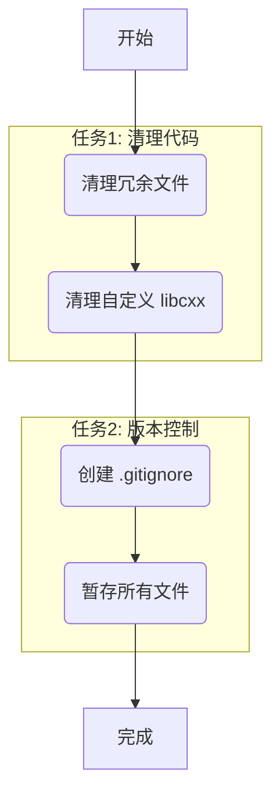

# 阶段3: Atomize (原子化阶段) - 项目优化任务清单

**目标:** 将设计方案分解为可独立执行和验证的原子任务。

## 1. 任务依赖图

## 2. 原子任务清单

### 任务 1.1: 删除冗余的 C++ 源文件
- **输入契约**: 文件 `module/src/main/cpp/example.cpp` 存在。
- **输出契约**: 文件 `module/src/main/cpp/example.cpp` 被删除。
- **实现约束**: 无。
- **依赖关系**: 无。

### 任务 1.2: 删除自定义 libcxx 的 CMake 脚本
- **输入契约**: 文件 `module/src/main/cpp/external/CMakeLists.txt` 存在。
- **输出契约**: 文件 `module/src/main/cpp/external/CMakeLists.txt` 被删除。
- **实现约束**: 无。
- **依赖关系**: 无。

### 任务 1.3: 删除自定义 libcxx 的源目录
- **输入契约**: 目录 `module/src/main/cpp/external/libcxx` 存在。
- **输出契约**: 目录 `module/src/main/cpp/external/libcxx` 及其所有内容被删除。
- **实现约束**: 无。
- **依赖关系**: 依赖于任务 1.2 完成。

### 任务 2.1: 创建 `.gitignore` 文件
- **输入契约**: 项目根目录下无 `.gitignore` 文件。
- **输出契约**:
    - `.gitignore` 文件被创建在项目根目录。
    - 文件内容与 `DESIGN` 文档中定义的完全一致。
- **实现约束**: 无。
- **依赖关系**: 无，可与任务1并行。

### 任务 2.2: 将所有相关文件添加到 Git 暂存区
- **输入契约**:
    - `.gitignore` 文件已创建。
    - 所有冗余文件已被删除。
    - `git status` 显示大量未跟踪和未暂存的文件。
- **输出契约**:
    - 运行 `git add .`。
    - `git status` 显示所有必需的文件都已处于 "Changes to be committed" 状态。
    - 被 `.gitignore` 规则匹配的文件（如 `build/` 目录）未被添加到暂存区。
- **实现约束**: 需要在所有文件修改操作完成后执行。
- **依赖关系**: 依赖于任务 1.1, 1.2, 1.3, 2.1 全部完成。

## 3. 下一步
进入 **阶段4: Approve (审批阶段)**，请您审查以上任务计划。如果确认无误，我将开始执行这些任务。
